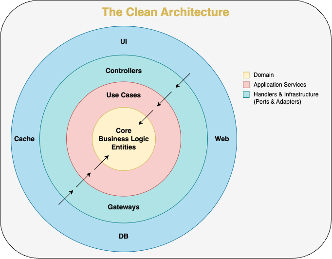

# order-manager

---

# Overview

The `order-manager` microservice is designed to handle the core aspects of order processing. This service offers a RESTful API to streamline various operations, including the creation, retrieval, and cancellation of orders, as well as the integration of status update webhooks from payment gateways and shipping providers. Additionally, it maintains up-to-date order statuses by processing incoming events. It also updates orders status through events. For instructions on how to get this microservice up and running, please refer to the [_`Getting Started`_](#getting-started) section.

## API Endpoints Overview

| Endpoint                              | Method | Description                                       |
| ------------------------------------- | ------ | ------------------------------------------------- |
| `/api/v1/orders`                      | GET    | Retrieve a list of all orders                     |
| `/api/v1/orders/:orderId`             | GET    | Retrieve details of a specific order by ID        |
| `/api/v1/orders/customer/:customerId` | GET    | Retrieve a list of all customer's orders          |
| `/api/v1/orders/status/:status`       | GET    | Retrieve a list of all orders with a given status |
| `/api/v1/orders`                      | POST   | Create or update an order                         |
| `/api/v1/orders/:orderId/cancel`      | POST   | Cancel an order                                   |
| `/api/v1/webhook/payment`             | POST   | Emulates PSPs callbacks of a payment transactions |
| `/api/v1/webhook/shipment`            | POST   | Emulates the status updates sent by the carrier   |

For detailed information on request and response formats, please refer to the complete API documentation at: `/api/docs`.

## Health Check

To ensure the service is running and healthy, you can use the root endpoint:

| Endpoint | Method | Description                                                     |
| -------- | ------ | --------------------------------------------------------------- |
| `/`      | GET    | A successful response indicates that the service is operational |

## Relevance [CRITICAL]

If this service is down:

- Orders will not be processed

## Sub-Components, Infrastructure/Service Dependencies

- [Mongo](https://www.mongodb.com/atlas/database)

## Architecture & Technologies

- **Architecture**: Inspired in a clean architecture combined with the hexagonal architecture and based on domain-driven design. Isolating domain citizens and application use-cases of any kind of external dependency.

  

  The folder structure follows the different layers:

  - [domain](./src/domain) for domain entities and interfaces (core)
  - [application](./src/application/) for application services (use-cases)
  - [handlers](./src/handlers) for the web API and event listeners (controllers and event handlers)
  - [infrastructure](./src/infrastructure) for infra implementations (e.g.: database)

- **Language**:

  - [**TypeScript**](https://www.typescriptlang.org/) (see [tsconfig.json](./tsconfig.json)) with [Node.js](https://nodejs.dev/)

- **App Framework**:

  - **Server**: [Express](https://expressjs.com/)
  - **Request validation**: [express-validator](https://express-validator.github.io/docs/)

- **Persistence**:

  - [**Database Module**](./src/infrastructure/db/database.module.ts) with [Mongo Client](./src/infrastructure/db/mongo/mongo-client.ts) using [mongoose](https://mongoosejs.com/)

- **Exceptions**:

  - [**Custom exceptions**](./src/domain/exceptions/) with [ts-error](https://github.com/gfmio/ts-error)

- **Observability**:

  - [**Logger**](./src/logger.module.ts) with [Pino](https://getpino.io/#/)

- **Documentation**:

  - **API**: [Swagger](https://swagger.io/) with [OpenAPI Specification](https://spec.openapis.org/oas/v3.1.0)
  - [**CHANGELOG**](./docs/CHANGELOG.md): All news, improvements and fixes

  All additional documentation can be found under [`docs`](./docs/).

- **Testing**

  - **Framework**: [jest](https://jestjs.io/) (see [jest.config.json](./jest.config.json))
  - **Component testing**: [SuperTest](https://github.com/visionmedia/supertest#readme)

- **Code style**:

  - [**Prettier**](https://prettier.io/) (see [.prettierrc](./.prettierrc))
  - [**ESLint**](https://eslint.org/) (see [.eslintrc](./.eslintrc))

## Getting Started

To run the service it is quick and easy, please check the steps [here](./docs/GETTING-STARTED.md).

## For Developers

See [CONTRIBUTING.md](./docs/CONTRIBUTING.md) and [TECHDEBT.md](./docs/TECHDEBT.md)

## License

This project is licensed under the MIT License. For more details, see the [LICENSE](./LICENSE) file.
